 # ARKit experiments
 
Default filter - at least 3 objects with all 8 3D bounding box vertices in the image

## All ARKit scenes
 
* as expected P3P > DP2P > UP2P
* BUT: for just 3 objects (or even at least 3 objects) in the scene DP2P is better for the tighter error levels
* P3P is even more superior for more objects in the scene
* DP2P with known in-plane rotation (roll) used

At least 3 objects in the scene 

| 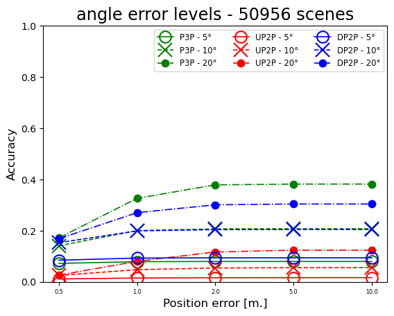 | 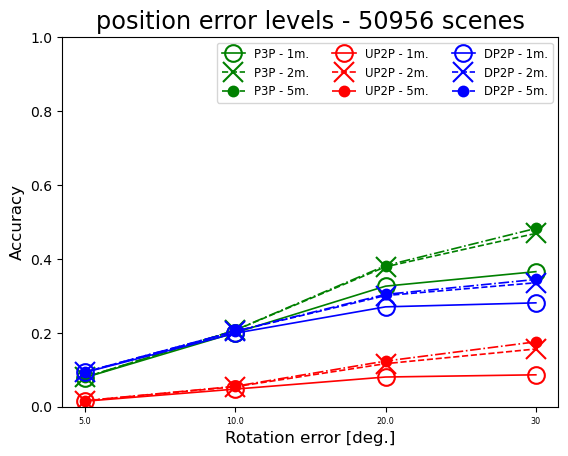 |
|--------------------------------------------------------------------------------------|---------------------------------------------------------------------------------------|

At least 5 objects in the scene 

| 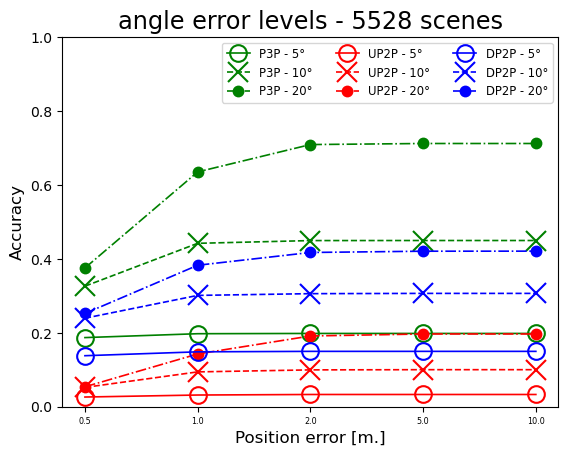 | 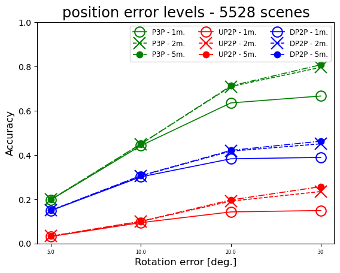 |
|--------------------------------------------------------------------------------------|-----------------------------------------------------------------------------------------|

Exactly 3 objects in the scene 

| 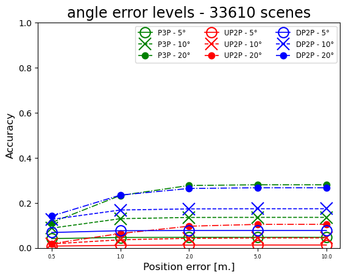 | 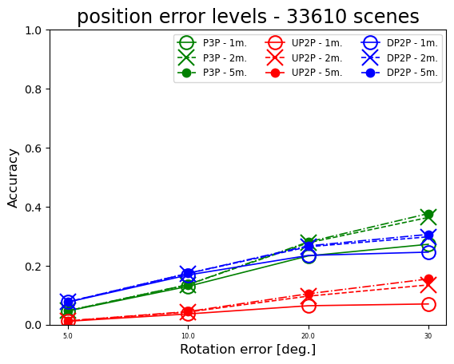 |
|---------------------------------------------------------------------------------------|------------------------------------------------------------------------------------------|

## ARKit scenes with in-plane rotation < 1 or 2 degrees
 
* as expected DP2P is the best
* DP2P with known in-plane rotation (roll) used

in-plane rotation < 1 degree 

| 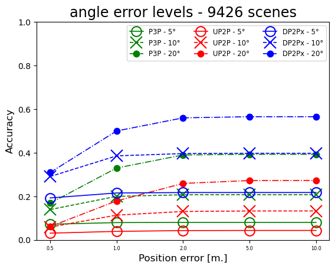 | 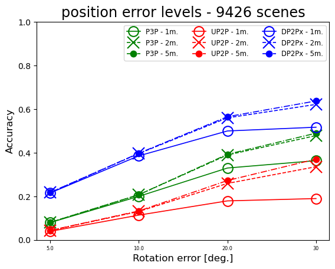 |
|-----------------------------------------------------------------------------------------------------|---------------------------------------------------------------------------------------------------------------|

in-plane rotation < 2 degrees 

| 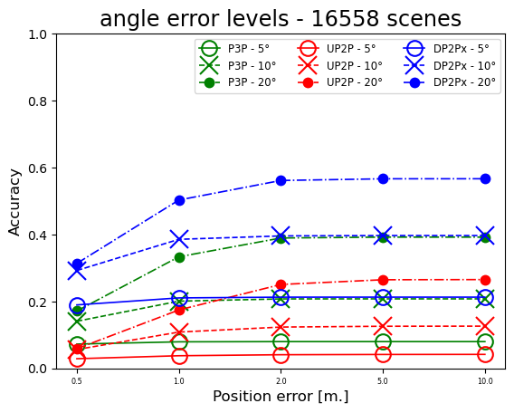 |  |
|-----------------------------------------------------------------------------------------------------|-----------------------------------------------------------------------------------------------------------|

## ARKit scenes with pitch < 1 or 2 degrees
 
* here UP2P is on par with DP2P
* I suspect this is because scenes with small pitch tend to be also vertically aligned - it can be seen by the number of scenes (will compute histogram for this) 
* DP2P with known pitch used

pitch < 1 degree 

| 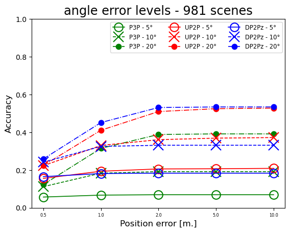 | 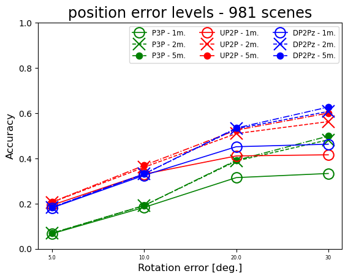 |
|-----------------------------------------------------------------------------------------------------|-----------------------------------------------------------------------------------------------------------|

pitch < 2 degrees 

| 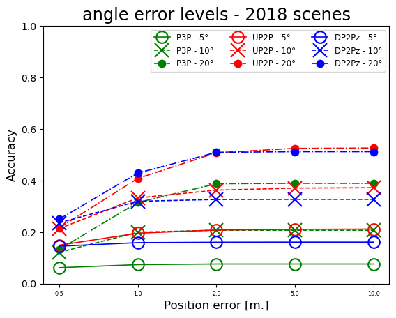 | 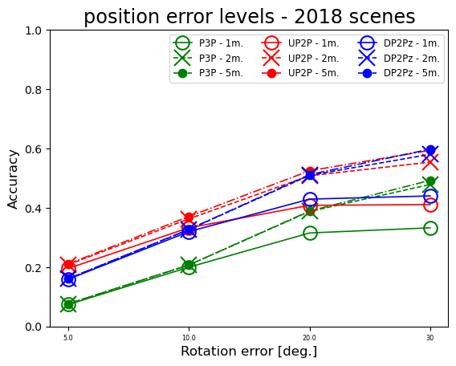 |
|-----------------------------------------------------------------------------------------------------|-----------------------------------------------------------------------------------------------------------|

## ARKit scenes with deviation from vertical direction < 1 or 2 degrees
 
* as expected UP2P is the best, 
* DP2P is second, better than P3P
* DP2P with known in-plane rotation (roll) used

deviation from vertical direction < 1 degree 

| 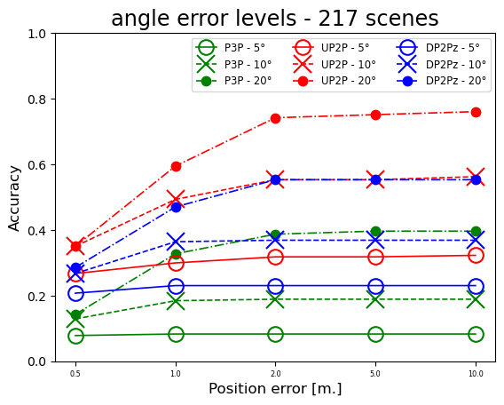 | 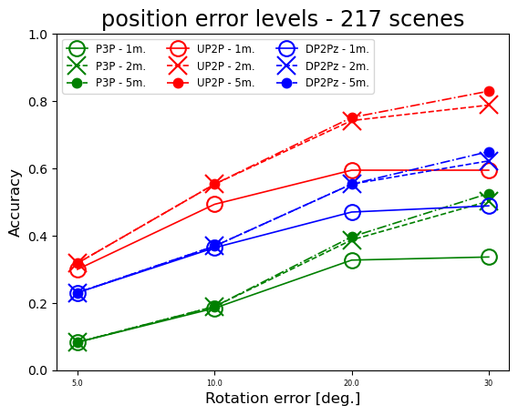 |
|----------------------------------------------------------------------------------------------------|-----------------------------------------------------------------------------------------------------------|

deviation from vertical direction < 2 degree 

| 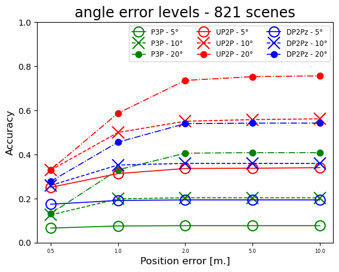 | 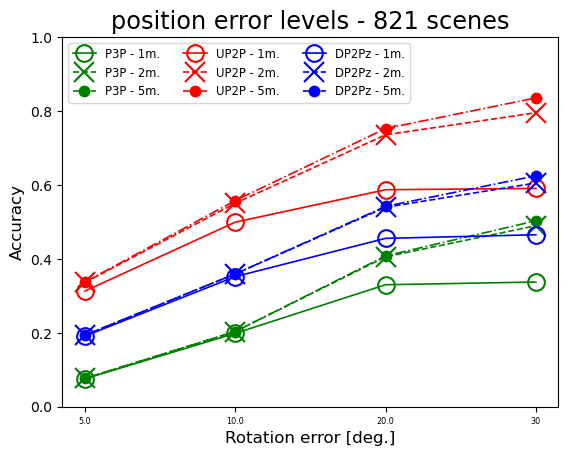 |
|----------------------------------------------------------------------------------------------------|----------------------------------------------------------------------------------------------------------|
