 # experiments with additional correspondences in ARKitScenes

## Adding the extra points to the potential inliers 

* Computing the inlier score with the extra points (extra points not included in the minimal samples)
* plots for #objects == #minimal-sample 

D2Px

* camera-x axis in horizontal plane < 1 degree deviation
* exactly 2 objects - 19222 imgs

| 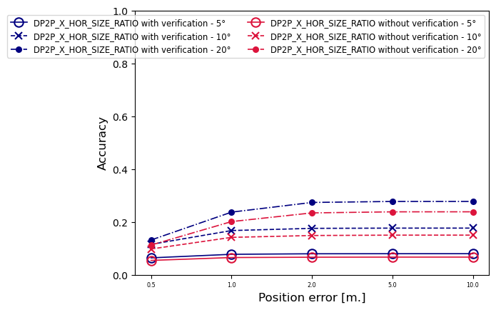 | 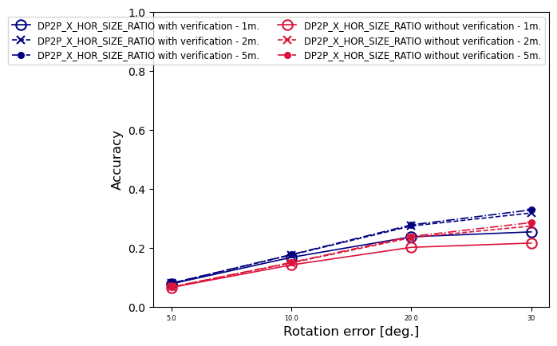 |
|---|---|

* < 1 degree deviation from gravity
* exactly 2 objects - 402 imgs

| 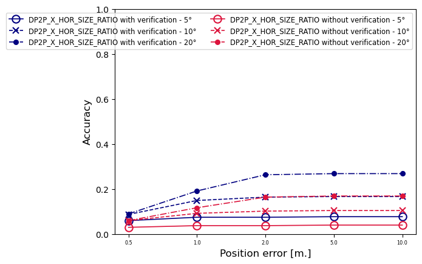 |  |
|-------------------------------------------------------------------------------------------------------------------------------------------------------------------------------------|----------------------------------------------------------------------------------------------------------------------------------------------------------------------------------------|

D2Pz

* camera-z axis in horizontal plane < 1 degree deviation
* exactly 2 objects - 1956 imgs

| 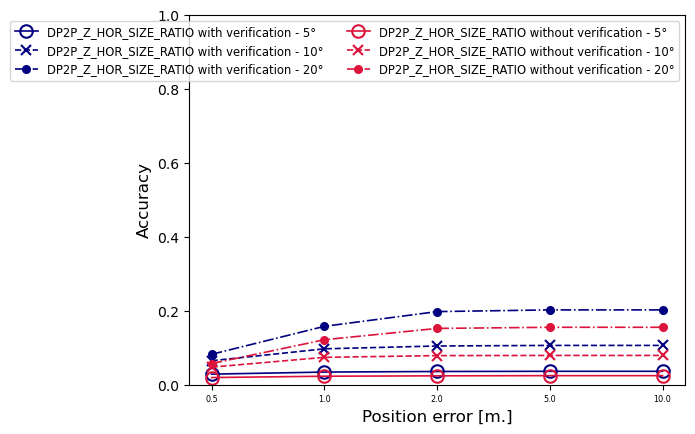 | 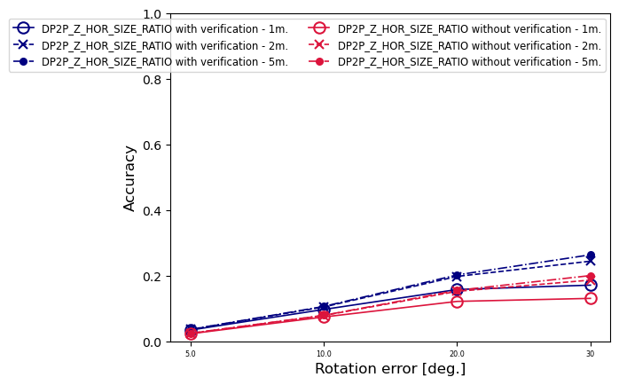 |
|---------------------------------------------------------------------------------------------------------------------------------------------------------------------------------------|---------------------------------------------------------------------------------------------------------------------------------------------------------------------------------------------|

* < 1 degree deviation from gravity
* exactly 2 objects - 402 imgs

|  |  |
|--------------------------------------------------------------------------------------------------------------------------------------------------------------------------------------|--------------------------------------------------------------------------------------------------------------------------------------------------------------------------------------------|

UP2P

* < 1 degree deviation from gravity
* exactly 2 objects - 402 imgs

|  | 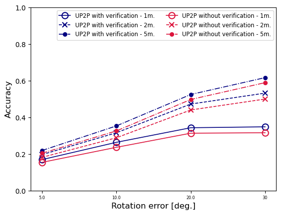 |
|-----------------------------------------------------------------------------------------------------------------------------------------------------------------------------------------------------|--------------------------------------------------------------------------------------------------------------------------------------------------------------------------------------|

P3P

* camera-x axis in horizontal plane < 1 degree deviation
* exactly 3 objects - 6265 imgs

| 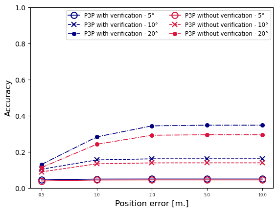 | 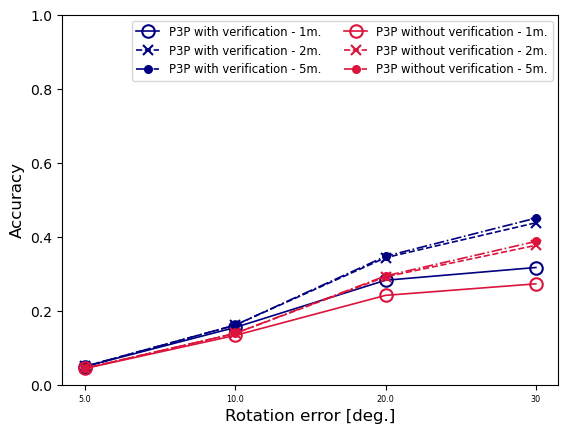 |
|-----------------------------------------------------------------------------------------------------------------------------------------------------------------------------------------|------------------------------------------------------------|

the results are similar for other pose classes (camera-z axis in horizontal plane < 1 degree deviation, < 1 degree deviation from gravity) 

## Choosing a single model 

* Choosing a single model from multiple models based on the score including upper extra points
* only when #objects == #minimal-sample, plots for the same only

D2Px

* camera-x axis in horizontal plane < 1 degree deviation
* exactly 2 objects - 19222 imgs

| 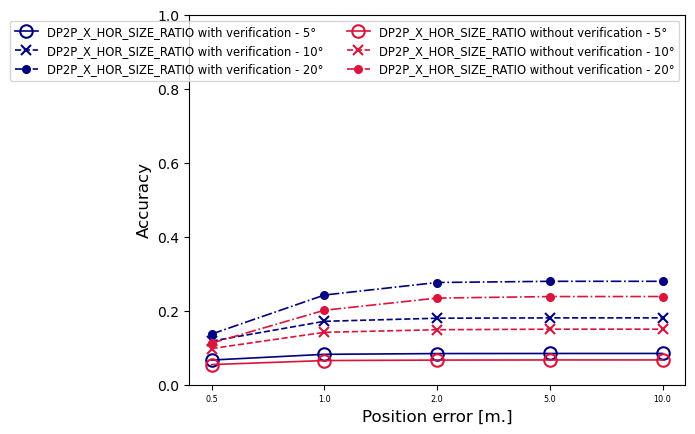 | 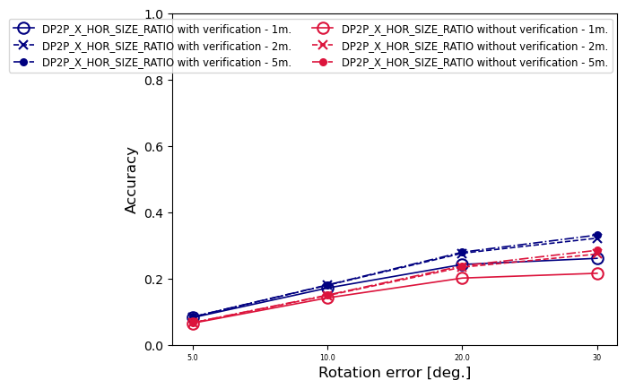 |
|---|---|

* < 1 degree deviation from gravity
* exactly 2 objects - 402 imgs

| 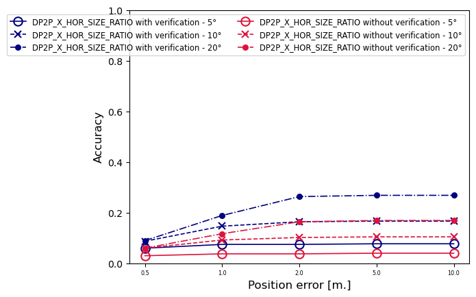 | 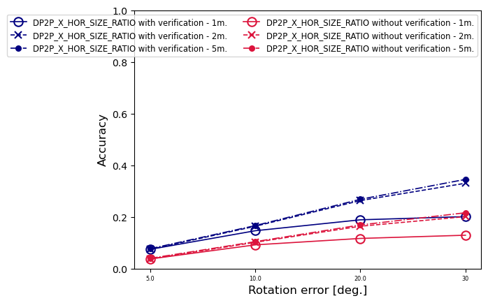 |
|-------------------------------------------------------------------------------------------------------------------------------------------------------------------------------------|----------------------------------------------------------------------------------------------------------------------------------------------------------------------------------------|

D2Pz

* camera-z axis in horizontal plane < 1 degree deviation
* exactly 2 objects - 1956 imgs

| 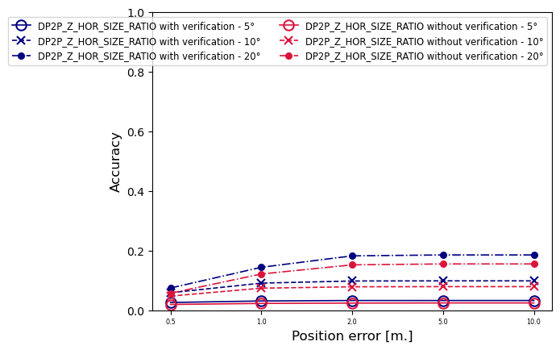 | 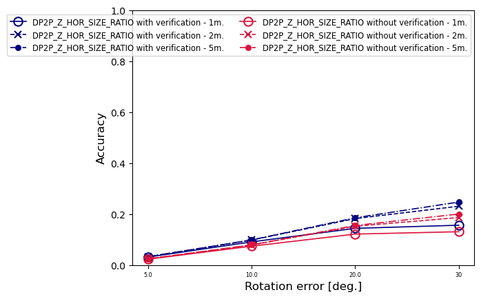 |
|---------------------------------------------------------------------------------------------------------------------------------------------------------------------------------------|---------------------------------------------------------------------------------------------------------------------------------------------------------------------------------------------|

* < 1 degree deviation from gravity
* exactly 2 objects - 402 imgs

| 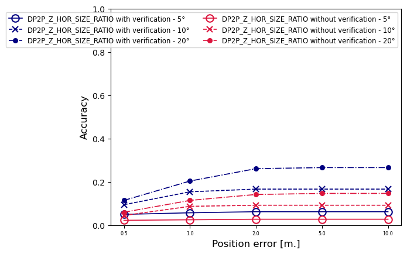 | 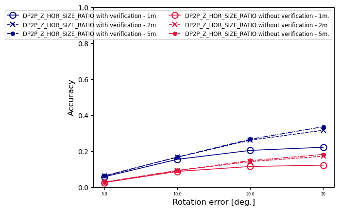 |
|--------------------------------------------------------------------------------------------------------------------------------------------------------------------------------------|--------------------------------------------------------------------------------------------------------------------------------------------------------------------------------------------|

UP2P

* < 1 degree deviation from gravity
* exactly 2 objects - 402 imgs

| 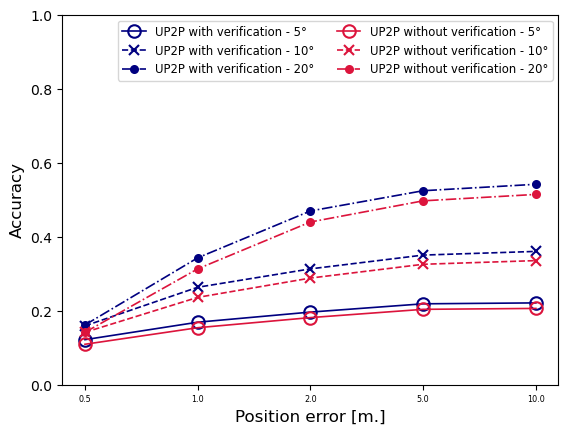 | 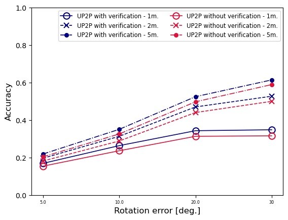 |
|------------------------------------------------------------------------------------------------------------------------------------------------------------------------------------|------------------------------------------------------------------------------------------------------------------------------------------------------------------------------------------|

P3P

* camera-x axis in horizontal plane < 1 degree deviation
* exactly 3 objects - 6265 imgs

| 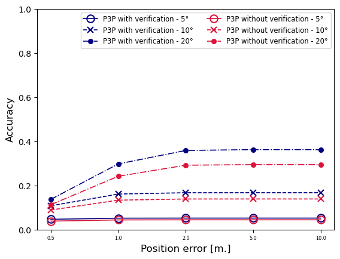 | 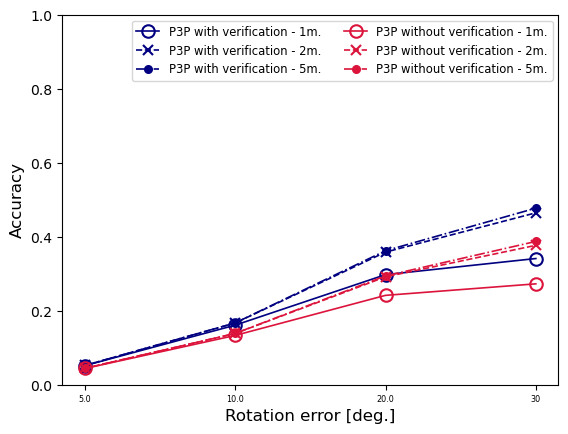 |
|-----------------------------------------------------------------------------------------------------------------------------------------------------------------------------------------|------------------------------------------------------------|

the results are similar for other pose classes (camera-z axis in horizontal plane < 1 degree deviation, < 1 degree deviation from gravity) 

