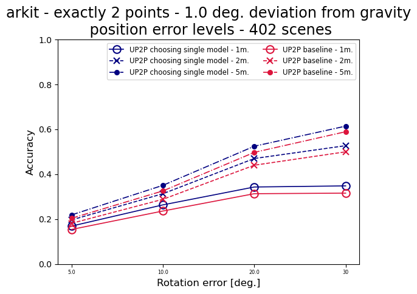
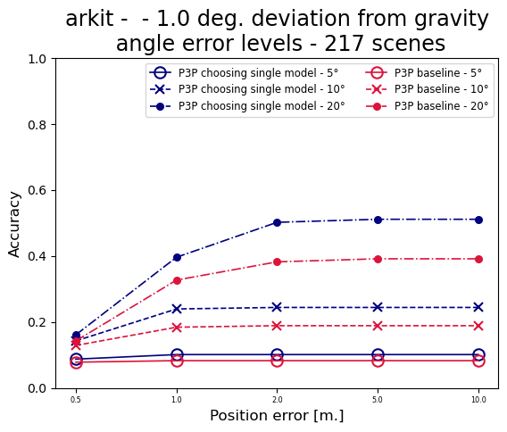
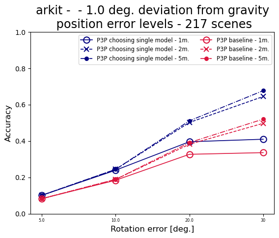
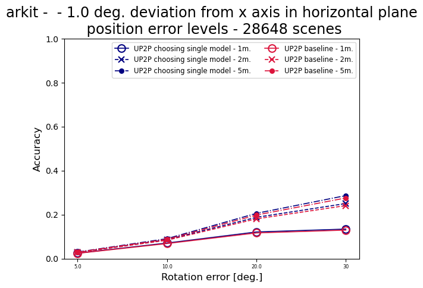
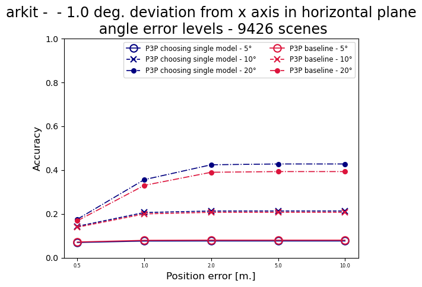
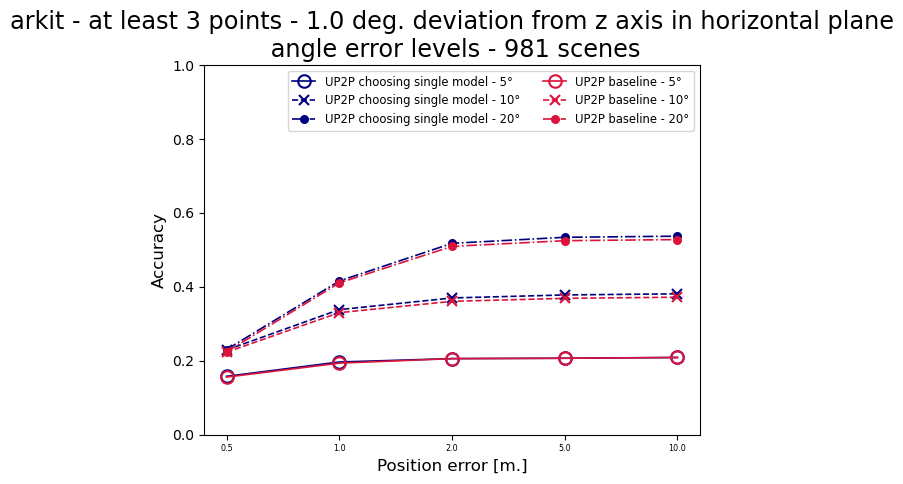
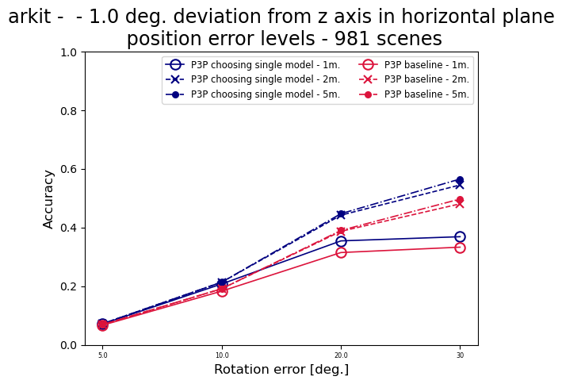

# Choosing a single model 

* Experiments comparing baseline with version choosing a single model from multiple models returned by the minimal solver,
based on the score with additional correspondences  
 
# ARKitScenes

## At most 1 degree deviation from gravity 

### D2Px

|  |  |
|---|------------------------------------------------------------------------------------------------------------------------------------------------------------------------------------------------------------------------------------|

|  |  |
|--------------------------------------------------------------------------------------------------------------------------------------------------------------------------------------------------------------------------------|------------------------------------------------------------------------------------------------------------------------------------------------------------------------------------------------------------------------------------|

|  |  |
|---------------------------------------------------------------------------------------------------------------------------------------------------------------------------------------------------------------------------------------|---------------------------------------------------------------------------------------------------------------------------------------------------------------------------------------------------------------------------------------------|

### D2Pz

|  |  |
|---|------------------------------------------------------------------------------------------------------------------------------------------------------------------------------------------------------------------------------------|

|  |  |
|--------------------------------------------------------------------------------------------------------------------------------------------------------------------------------------------------------------------------------|------------------------------------------------------------------------------------------------------------------------------------------------------------------------------------------------------------------------------------|

|  |  |
|---------------------------------------------------------------------------------------------------------------------------------------------------------------------------------------------------------------------------------------|---------------------------------------------------------------------------------------------------------------------------------------------------------------------------------------------------------------------------------------------|

### UP2P

|  |  |
|---|------------------------------------------------------------------------------------------------------------------------------------------------------------------------------------------------------------------------------------|

|  |  |
|--------------------------------------------------------------------------------------------------------------------------------------------------------------------------------------------------------------------------------|------------------------------------------------------------------------------------------------------------------------------------------------------------------------------------------------------------------------------------|

|  |  |
|---------------------------------------------------------------------------------------------------------------------------------------------------------------------------------------------------------------------------------------|---------------------------------------------------------------------------------------------------------------------------------------------------------------------------------------------------------------------------------------------|

### P3P

|  |  |
|---|------------------------------------------------------------------------------------------------------------------------------------------------------------------------------------------------------------------------------------|

|  |  |
|--------------------------------------------------------------------------------------------------------------------------------------------------------------------------------------------------------------------------------|------------------------------------------------------------------------------------------------------------------------------------------------------------------------------------------------------------------------------------|

|  |  |
|-------------------------------------------------------------------------------------------------------------------------------------------------------------------------------------------------|-------------------------------------------------------------------------------------------------------------------------------------------------------------------------------------------------------|

## Camera x-axis deviated at most 1 degree from the horizontal plane 

### D2Px

|  |  |
|---|------------------------------------------------------------------------------------------------------------------------------------------------------------------------------------------------------------------------------------|

|  |  |
|--------------------------------------------------------------------------------------------------------------------------------------------------------------------------------------------------------------------------------|------------------------------------------------------------------------------------------------------------------------------------------------------------------------------------------------------------------------------------|

|  |  |
|---------------------------------------------------------------------------------------------------------------------------------------------------------------------------------------------------------------------------------------|---------------------------------------------------------------------------------------------------------------------------------------------------------------------------------------------------------------------------------------------|

### UP2P

|  |  |
|---|------------------------------------------------------------------------------------------------------------------------------------------------------------------------------------------------------------------------------------|

|  |  |
|--------------------------------------------------------------------------------------------------------------------------------------------------------------------------------------------------------------------------------|------------------------------------------------------------------------------------------------------------------------------------------------------------------------------------------------------------------------------------|

|  |  |
|---------------------------------------------------------------------------------------------------------------------------------------------------------------------------------------------------------------------------------------|---------------------------------------------------------------------------------------------------------------------------------------------------------------------------------------------------------------------------------------------|

### P3P

|  |  |
|---|------------------------------------------------------------------------------------------------------------------------------------------------------------------------------------------------------------------------------------|

|  |  |
|--------------------------------------------------------------------------------------------------------------------------------------------------------------------------------------------------------------------------------|------------------------------------------------------------------------------------------------------------------------------------------------------------------------------------------------------------------------------------|

|  |  |
|-------------------------------------------------------------------------------------------------------------------------------------------------------------------------------------------------|-------------------------------------------------------------------------------------------------------------------------------------------------------------------------------------------------------|

## Camera z-axis deviated at most 1 degree from the horizontal plane 

### D2Pz

|  |  |
|---|------------------------------------------------------------------------------------------------------------------------------------------------------------------------------------------------------------------------------------|

|  |  |
|--------------------------------------------------------------------------------------------------------------------------------------------------------------------------------------------------------------------------------|------------------------------------------------------------------------------------------------------------------------------------------------------------------------------------------------------------------------------------|

|  |  |
|---------------------------------------------------------------------------------------------------------------------------------------------------------------------------------------------------------------------------------------|---------------------------------------------------------------------------------------------------------------------------------------------------------------------------------------------------------------------------------------------|

### UP2P

|  |  |
|---|------------------------------------------------------------------------------------------------------------------------------------------------------------------------------------------------------------------------------------|

|  |  |
|--------------------------------------------------------------------------------------------------------------------------------------------------------------------------------------------------------------------------------|------------------------------------------------------------------------------------------------------------------------------------------------------------------------------------------------------------------------------------|

|  |  |
|---------------------------------------------------------------------------------------------------------------------------------------------------------------------------------------------------------------------------------------|---------------------------------------------------------------------------------------------------------------------------------------------------------------------------------------------------------------------------------------------|

### P3P

|  |  |
|---|------------------------------------------------------------------------------------------------------------------------------------------------------------------------------------------------------------------------------------|

|  |  |
|--------------------------------------------------------------------------------------------------------------------------------------------------------------------------------------------------------------------------------|------------------------------------------------------------------------------------------------------------------------------------------------------------------------------------------------------------------------------------|

|  |  |
|-------------------------------------------------------------------------------------------------------------------------------------------------------------------------------------------------|-------------------------------------------------------------------------------------------------------------------------------------------------------------------------------------------------------|

## All scenes

### D2Px

|  |  |
|---|------------------------------------------------------------------------------------------------------------------------------------------------------------------------------------------------------------------------------------|

|  |  |
|--------------------------------------------------------------------------------------------------------------------------------------------------------------------------------------------------------------------------------|------------------------------------------------------------------------------------------------------------------------------------------------------------------------------------------------------------------------------------|

|  |  |
|---------------------------------------------------------------------------------------------------------------------------------------------------------------------------------------------------------------------------------------|---------------------------------------------------------------------------------------------------------------------------------------------------------------------------------------------------------------------------------------------|

### D2Pz

|  |  |
|---|------------------------------------------------------------------------------------------------------------------------------------------------------------------------------------------------------------------------------------|

|  |  |
|--------------------------------------------------------------------------------------------------------------------------------------------------------------------------------------------------------------------------------|------------------------------------------------------------------------------------------------------------------------------------------------------------------------------------------------------------------------------------|

|  |  |
|---------------------------------------------------------------------------------------------------------------------------------------------------------------------------------------------------------------------------------------|---------------------------------------------------------------------------------------------------------------------------------------------------------------------------------------------------------------------------------------------|

### UP2P

|  |  |
|---|------------------------------------------------------------------------------------------------------------------------------------------------------------------------------------------------------------------------------------|

|  |  |
|--------------------------------------------------------------------------------------------------------------------------------------------------------------------------------------------------------------------------------|------------------------------------------------------------------------------------------------------------------------------------------------------------------------------------------------------------------------------------|

|  |  |
|---------------------------------------------------------------------------------------------------------------------------------------------------------------------------------------------------------------------------------------|---------------------------------------------------------------------------------------------------------------------------------------------------------------------------------------------------------------------------------------------|

### P3P

|  |  |
|---|------------------------------------------------------------------------------------------------------------------------------------------------------------------------------------------------------------------------------------|

|  |  |
|--------------------------------------------------------------------------------------------------------------------------------------------------------------------------------------------------------------------------------|------------------------------------------------------------------------------------------------------------------------------------------------------------------------------------------------------------------------------------|

|  |  |
|-------------------------------------------------------------------------------------------------------------------------------------------------------------------------------------------------|-------------------------------------------------------------------------------------------------------------------------------------------------------------------------------------------------------|

