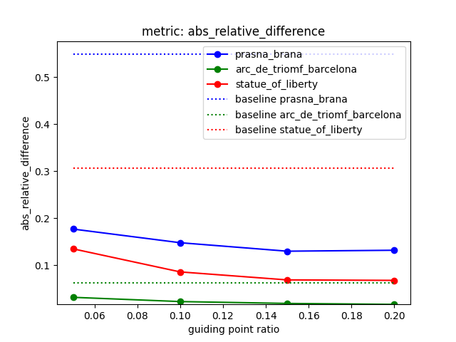
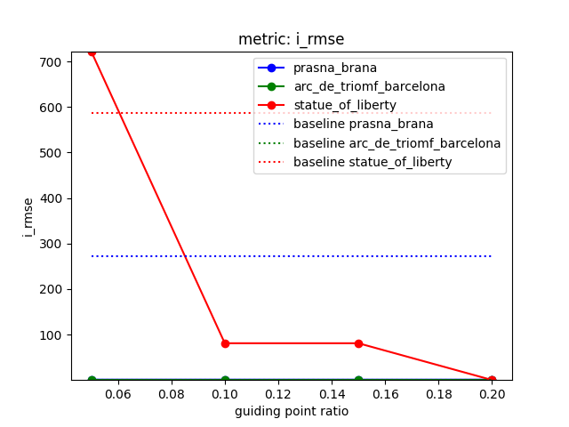
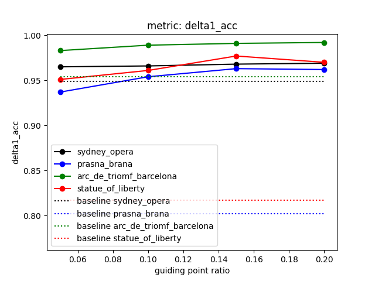
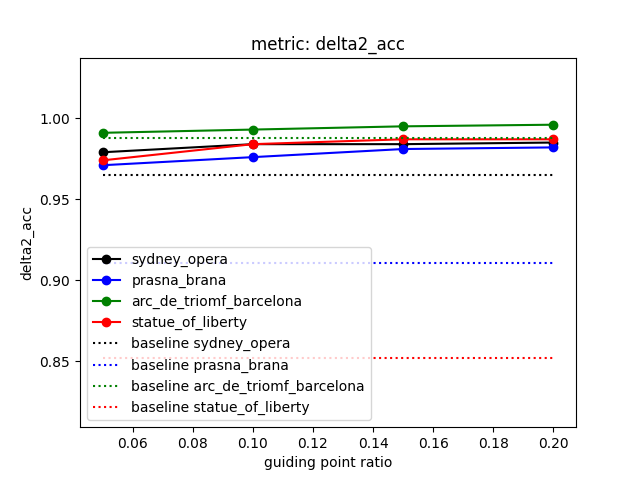
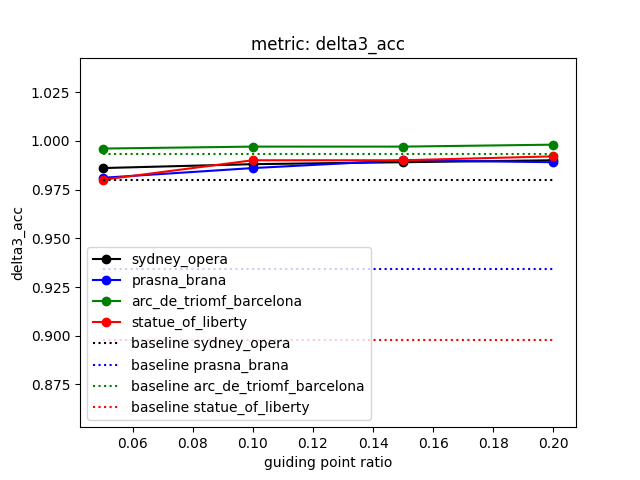
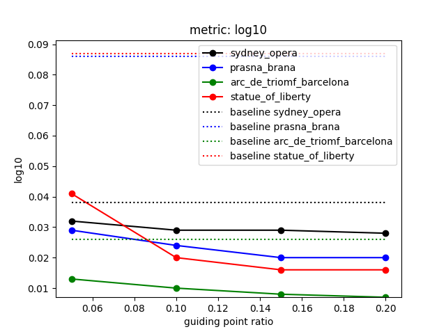
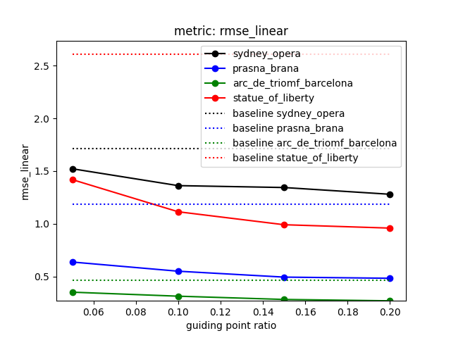
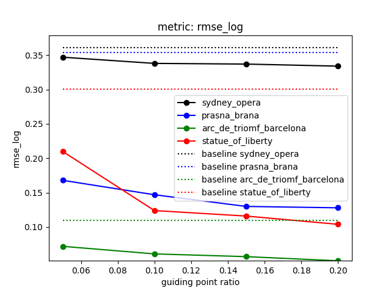
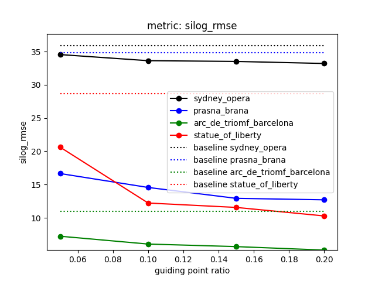
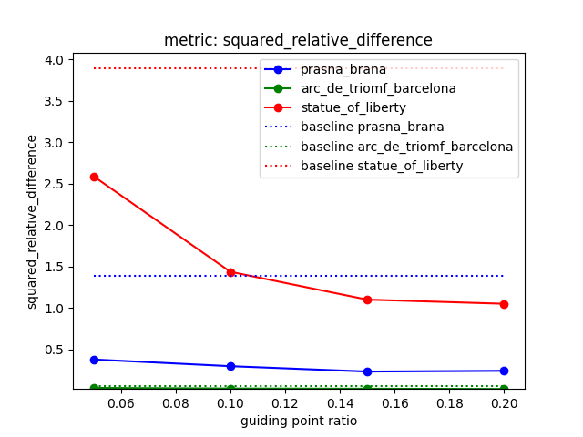

# Experiment setup

* Measured on 4 SfM scenes each having 50 imgs
  * the depth completion pipeline is quite slow (~1 min/img in my setup; there is no training, the heavy-lifting is done in inference)
  * different average number of all correspondences per scene: 
    * prasna_brana - 685.2
    * statue_of_liberty - 280.9
    * arc_de_triomf_barcelona - 241.6
    * sydney_opera - 87.0

* Compared are Marigold e2e (https://arxiv.org/abs/2409.11355; denoted as baseline) and 
Marigold-DC (https://arxiv.org/abs/2412.13389) with
varying ratio of guidance points (0.05, 0.1, 0.15 and 0.2 of all the correspondences from SfM). 

* All metric are measured AFTER least-squares alignment

* Possible improvements
  * finer grained variation of the guidance points
  * guidance points varied based on the count, not the ratio
  * alignment via RANSAC

* Interpretation
  * even small number of points helps to improve the inference
  * the adjustment is non-linear as it helps even after the alignment
  * some data are left out (sydney opera for the absolute relative difference metric), as they are way off

| |  |
|-------------------------------------------------------------------------|-|

| |  |
|-------------------------------------------------------------------------|-|

|  |  |
|-|-|

|  |  |
|---------------------------------------|---------------------------------------|

|  |  |
|---------------------------------------|---------------------------------------|

|  |  |
|----------------------------------------------|---------------------------------------|

|  |  |
|----------------------------------------------|---------------------------------------|