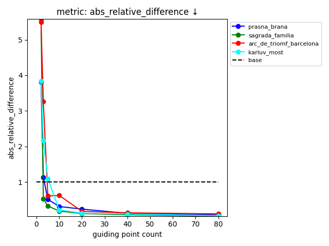
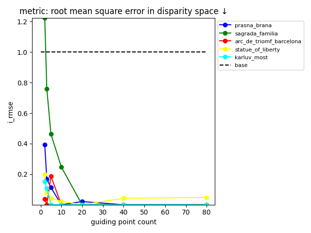
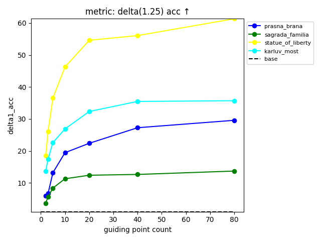
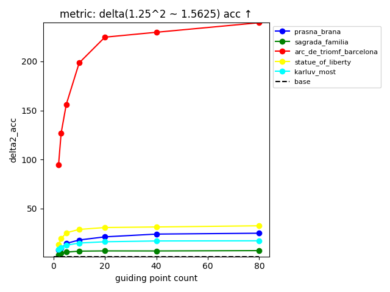
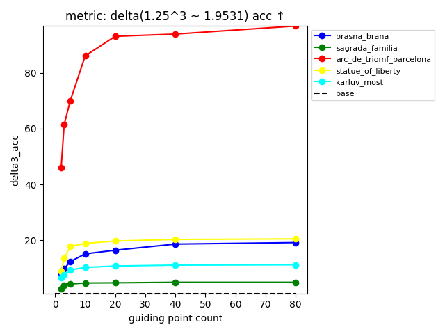
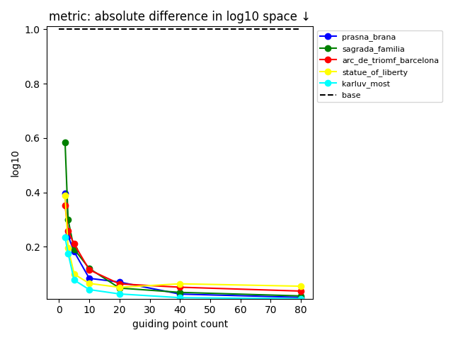
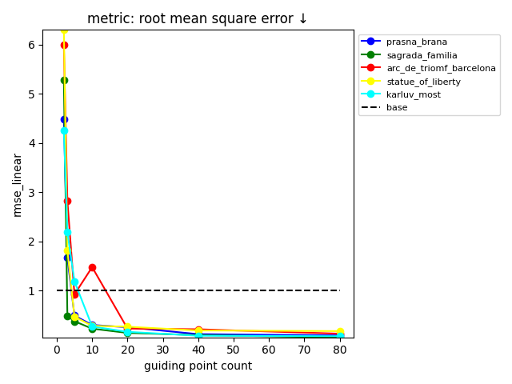
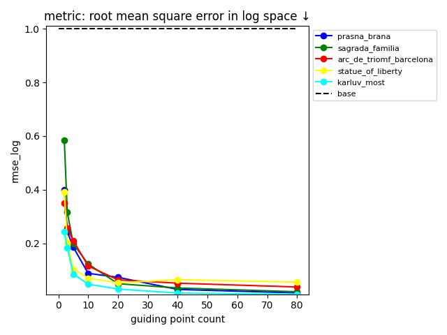
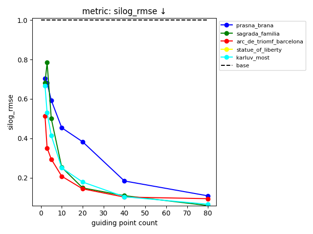
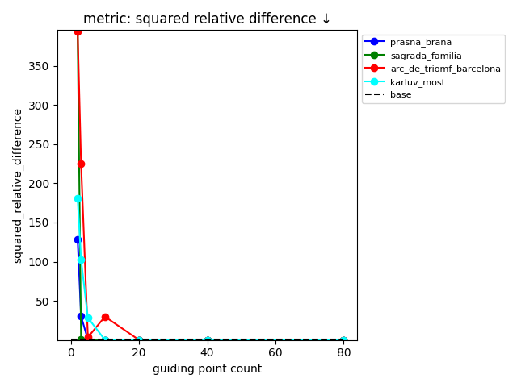

# Experiment setup

* Showing plots relative to the baseline
* After alignment with RANSAC in disparity space with inlier threshold of 0.1 
* Showing 0.9 quantile (relative distance) of the data

* Measured on 5 SfM scenes each having 100 imgs
* The depth completion pipeline is quite slow (~1 min/img in my setup; there is no training, the heavy-lifting is done in inference)

* Compared are 
  * Marigold e2e (https://arxiv.org/abs/2409.11355; denoted as baseline) and 
  * Marigold-DC (https://arxiv.org/abs/2412.13389) with varying ratio of guidance points 
   (2, 3, 5, 10, 20, 40 and 80 random(!) points from SfM). 

* Interpretation
  * even small number of points helps to improve the inference
  * the adjustment is non-linear as it helps even after the alignment
  * some data are left out (arc_de_triomf for delta(1.25) acc) as they are way off

 |  |  |
|-|-|

 |  |  |
|-|-|

 |  |  |
|-|-|

 |  |  |
|-|-|

 |  |  |
|-|-|

