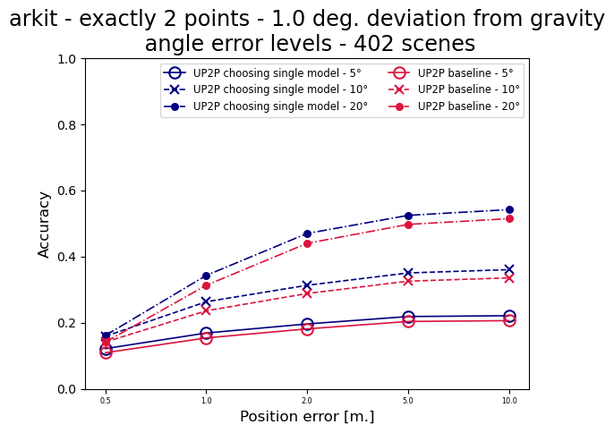
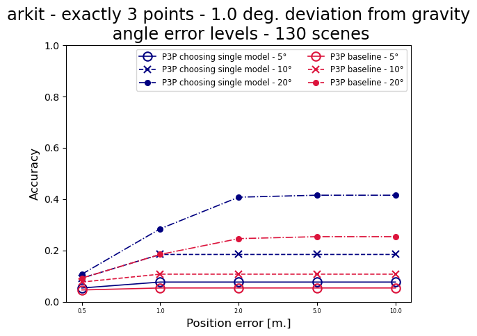
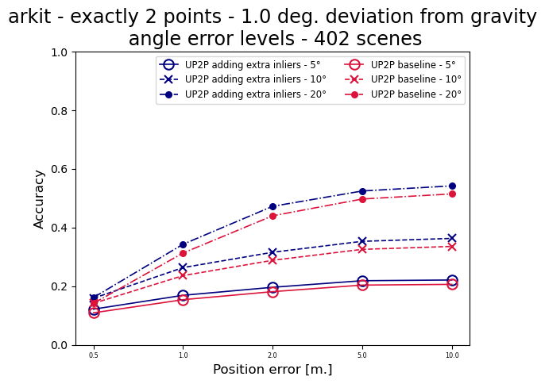

# Summary of experiments using extra correspondences 

* Extra correspondences are between the center of top-face (3D BB) and the midpoint of the top line segment (2D BB)   

## Modes of exploitation

### Choosing a single model from models returned by the minimal solver 

* Choosing a single model from multiple models returned by the minimal solver, based on the score with additional correspondences 
related to the minimal sample
 
* As may have been expected, this helps if #points == minimal sample, otherwise the increase in performance is usually small 
or even negative - this holds for both ARKitScenes and Metropolis datasets
* Detailed plots: 
  * [ARKitScenes](choose_single_model_arkit.md)
  * [Metropolis](choose_single_model_metropolis.md)

* Examples: ARKitScenes, <1 degree from gravity, #points == minimal sample

  * D2Px

|  |  |
|--------------------------------------------------------------------------------------------------------------------------------------------------------------------------------------------------------------------------------|------------------------------------------------------------------------------------------------------------------------------------------------------------------------------------------------------------------------------------|

  * UP2P

|  |  |
|--------------------------------------------------------------------------------------------------------------------------------------------------------------------------------------------------------------------------------|------------------------------------------------------------------------------------------------------------------------------------------------------------------------------------------------------------------------------------|

  * P3P

|  |  |
|--------------------------------------------------------------------------------------------------------------------------------------------------------------------------------------------------------------------------------|------------------------------------------------------------------------------------------------------------------------------------------------------------------------------------------------------------------------------------|

### Extra correspondences as first class citizens 

* For ARKitScenes: helps more for small deviation from gravity (the extra correspondences are not very error contaminated) than for other 
classes of camera rotation
* For ARKitScenes: helps the best for scenes with #points == minimal sample 
* For Metropolis: helps everywhere 
* Detailed plots:
  * [ARKitScenes](extra_correspondences_arkit.md)
  * [Metropolis](extra_correspondences_metropolis.md)

* Examples: Metropolis - all scenes, #points == minimal sample

  * D2Pz

|  |  |
|--------------------------------------------------------------------------------------------------------------------------------------------------------------------------------------------------------------------------------|------------------------------------------------------------------------------------------------------------------------------------------------------------------------------------------------------------------------------------|

  * UP2P

|  |  |
|--------------------------------------------------------------------------------------------------------------------------------------------------------------------------------------------------------------------------------|------------------------------------------------------------------------------------------------------------------------------------------------------------------------------------------------------------------------------------|

  * P3P

|  |  |
|--------------------------------------------------------------------------------------------------------------------------------------------------------------------------------------------------------------------------------|------------------------------------------------------------------------------------------------------------------------------------------------------------------------------------------------------------------------------------|

### All extra correspondences added to the inlier score  

* For ARKitScenes: helps quite consistently to improve performance of all solvers, mostly in the space case camera rotations
* For Metropolis: helps to improve performance for all solvers, but interestingly enough, 
it doesn't change the performance for scenes with #points == minimal sample (!!!)
* Detailed plots:
  * [ARKitScenes](inliers_all_arkit.md)
  * [Metropolis](inliers_all_metropolis.md)

* Examples: Metropolis - all scenes, #points == minimal sample

  * D2Pz

|  |  |
|--------------------------------------------------------------------------------------------------------------------------------------------------------------------------------------------------------------------------------|------------------------------------------------------------------------------------------------------------------------------------------------------------------------------------------------------------------------------------|

  * UP2P

|  |  |
|--------------------------------------------------------------------------------------------------------------------------------------------------------------------------------------------------------------------------------|------------------------------------------------------------------------------------------------------------------------------------------------------------------------------------------------------------------------------------|

  * P3P

|  |  |
|--------------------------------------------------------------------------------------------------------------------------------------------------------------------------------------------------------------------------------|------------------------------------------------------------------------------------------------------------------------------------------------------------------------------------------------------------------------------------|

### Extra correspondences only related to the minimal sample are added to the inlier score

* Very similar to the previous method 
* Detailed plots:
  * [ARKitScenes](inliers_sample_arkit.md)
  * [Metropolis](inliers_sample_metropolis.md)
