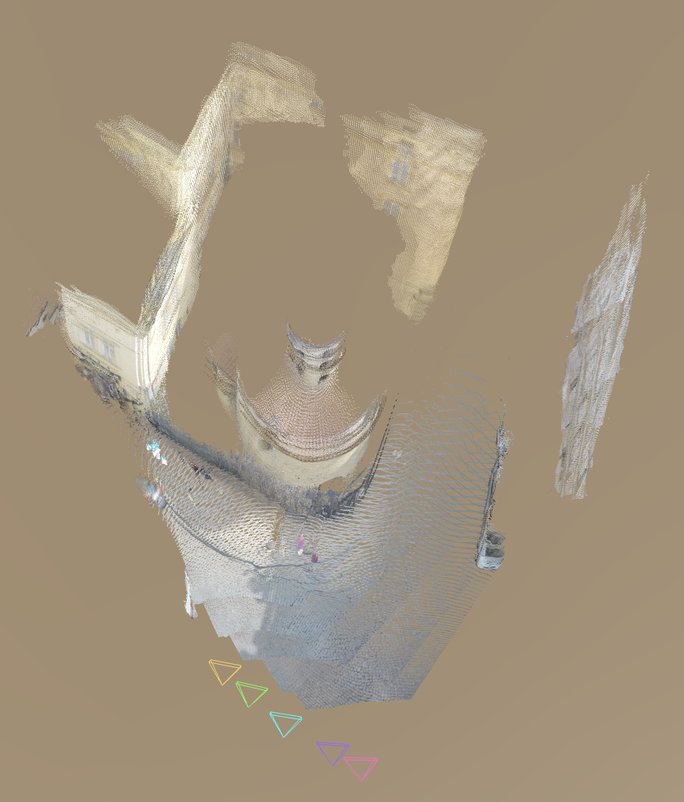
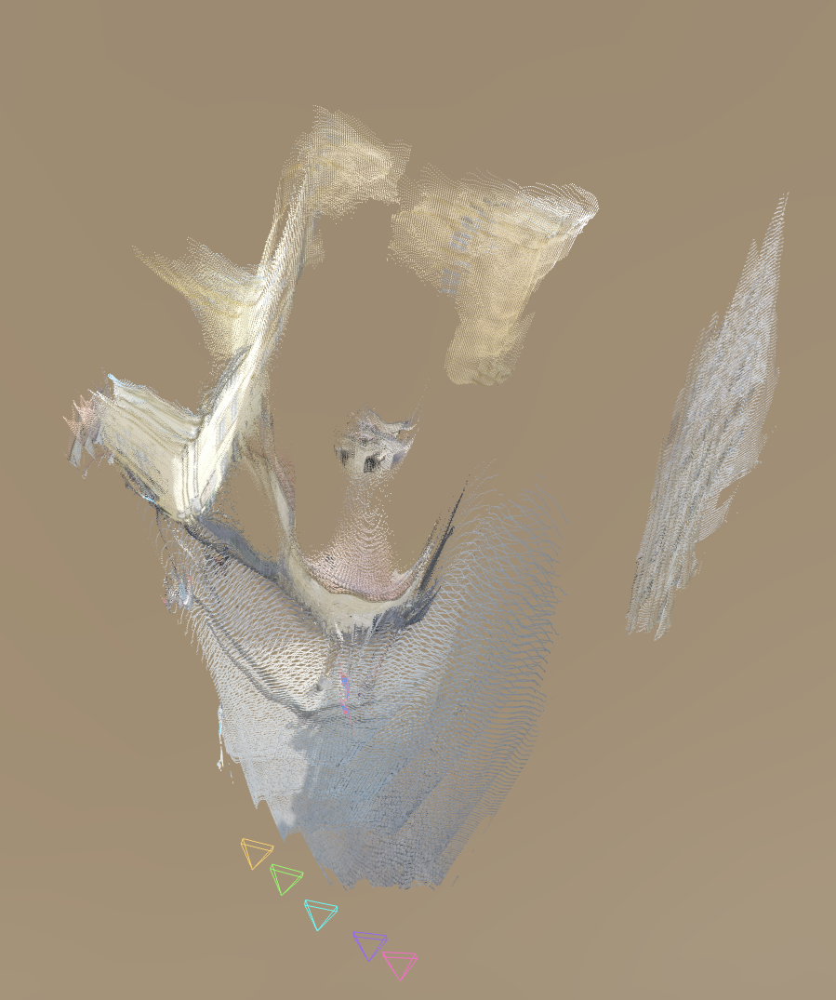
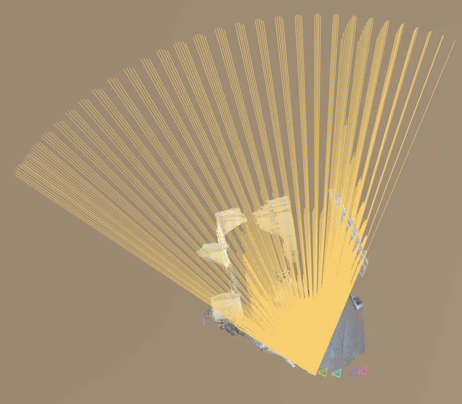
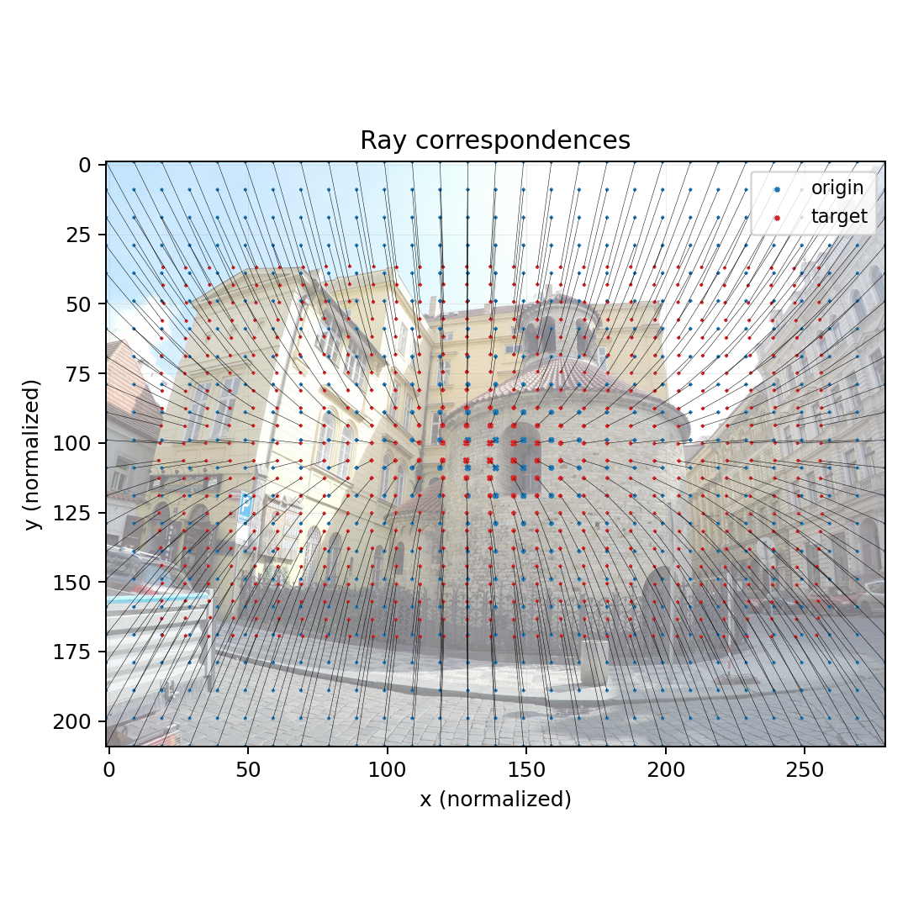
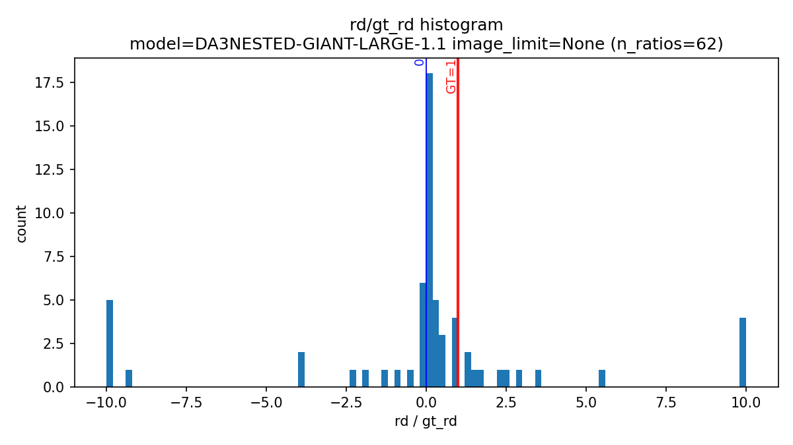
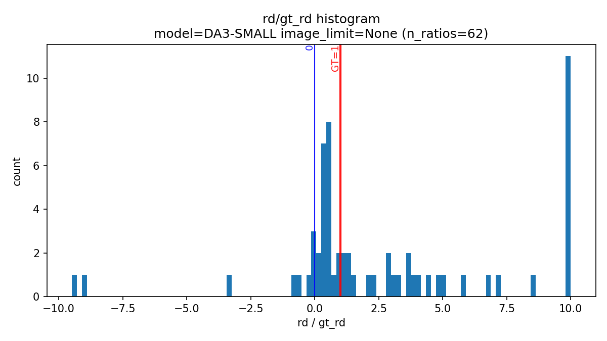
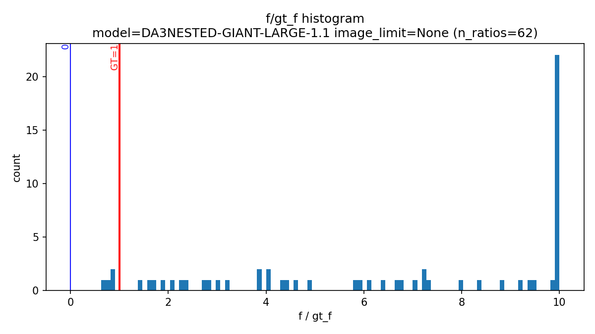
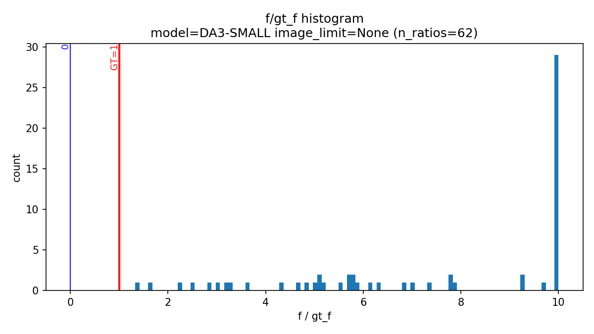

## The reconstruction

As expected, the [reconstruction](rd_estimation/resources/reconstruction_largest_5_images.glb) is the best from the largest model:

notice the edge of the building on the left - it is a bit bounded. For comparison, this is much better than the [reconstruction](rd_estimation/resources/reconstruction_smallest_5_images.glb) from the smallest model - here: 

These reconstructions are from just 5 images. If I add all images from the dataset (62 images from the distorted camera), there will appear some artifacts in the [reconstruction](rd_estimation/resources/reconstruction_largest_all_images.glb): 

The [visualization](rd_estimation/resources/reconstruction_larges_5_images_rays_img_0.glb) of the rays do not reveal much, although it can be seen that the rays on the right do not align with the wall of the building

## The correspondences

This shows correspondences between the intersections (3D) of the rays and the image plane and the 2D coordinates of the grid of the image. Indeed for this image the radial distortion is estimated fairly correctly (-0.9 vs GT=-0.81).    

## Results

These plots show the ratio between the estimated and the GT radial distortion parameter for all the distorted images in the 'rotunda' dataset. The values are clamped at the maximum of 10. The results for the largest (top) and the smallest (bottom) model are quite similar. They are somewhat odd, but still lean to the GT value. 

However, the focal length estimation overestimates f quite much. These plots show the ratio between the estimated and the GT f for all the distorted images in the 'rotunda' dataset. The values are clamped at the maximum of 10. The results for the largest (top) and the smallest (bottom) model are quite similar.

