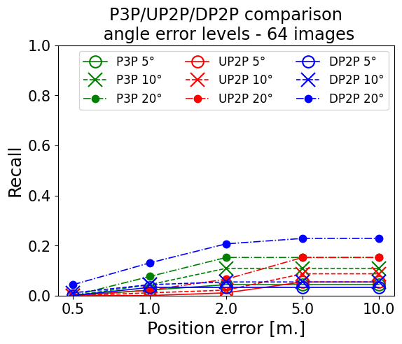
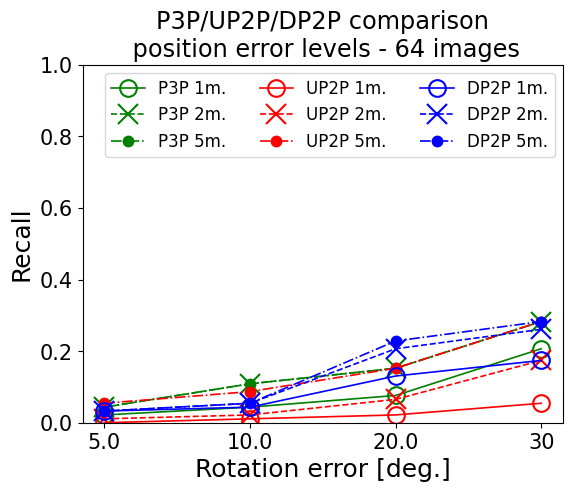
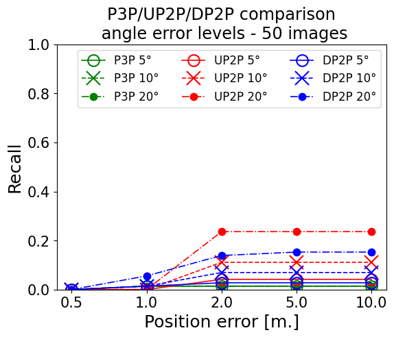
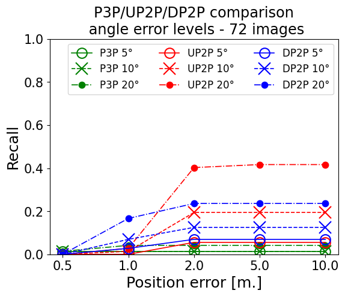
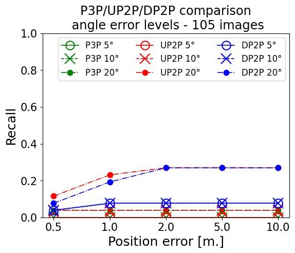
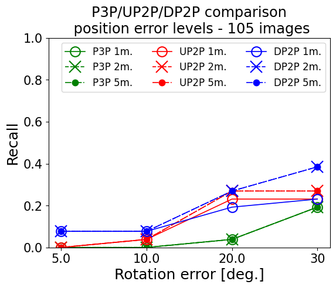

# Localization on twelve scenes

* compared to direct pose estimation
* correspondences based on object classes

## apt1 / kitchen

### Localization 

|  |  | 
|-----------------------------------------------------------------------------------------------------------------------|--------------------------------------------------------------------------------------------------------------------------------------------|
### Direct pose estimation

|  |  | 
|-----------------------------------------------------------------------------------------------------------------------|--------------------------------------------------------------------------------------------------------------------------------------------|

## apt1 / living

### Localization 

|  | | 
|-----------------------------------------------------------------------------------------------------------------------|--------------------------------------------------------------------------------------------------------------------------------------------|
### Direct pose estimation

|  | | 
|-----------------------------------------------------------------------------------------------------------------------|--------------------------------------------------------------------------------------------------------------------------------------------|

## apt2 / kitchen

### Localization 

|  | | 
|-----------------------------------------------------------------------------------------------------------------------|--------------------------------------------------------------------------------------------------------------------------------------------|

### Direct pose estimation

|  | | 
|-----------------------------------------------------------------------------------------------------------------------|--------------------------------------------------------------------------------------------------------------------------------------------|

## apt2 / living

### Localization 

|  | | 
|-----------------------------------------------------------------------------------------------------------------------|--------------------------------------------------------------------------------------------------------------------------------------------|

### Direct pose estimation

|  | | 
|-----------------------------------------------------------------------------------------------------------------------|--------------------------------------------------------------------------------------------------------------------------------------------|

## apt2 / bed

### Localization 

|  | | 
|-----------------------------------------------------------------------------------------------------------------------|--------------------------------------------------------------------------------------------------------------------------------------------|

### Direct pose estimation

|  | | 
|-----------------------------------------------------------------------------------------------------------------------|--------------------------------------------------------------------------------------------------------------------------------------------|

## apt2 / luke

### Localization 

|  | | 
|-----------------------------------------------------------------------------------------------------------------------|--------------------------------------------------------------------------------------------------------------------------------------------|

### Direct pose estimation

|  | | 
|-----------------------------------------------------------------------------------------------------------------------|--------------------------------------------------------------------------------------------------------------------------------------------|

## office2 / 5a

### Localization 

|  | | 
|-----------------------------------------------------------------------------------------------------------------------|--------------------------------------------------------------------------------------------------------------------------------------------|

### Direct pose estimation

|  | | 
|-----------------------------------------------------------------------------------------------------------------------|--------------------------------------------------------------------------------------------------------------------------------------------|

## office2 / 5b

### Localization 

|  | | 
|-----------------------------------------------------------------------------------------------------------------------|--------------------------------------------------------------------------------------------------------------------------------------------|

### Direct pose estimation

|  | | 
|-----------------------------------------------------------------------------------------------------------------------|--------------------------------------------------------------------------------------------------------------------------------------------|

